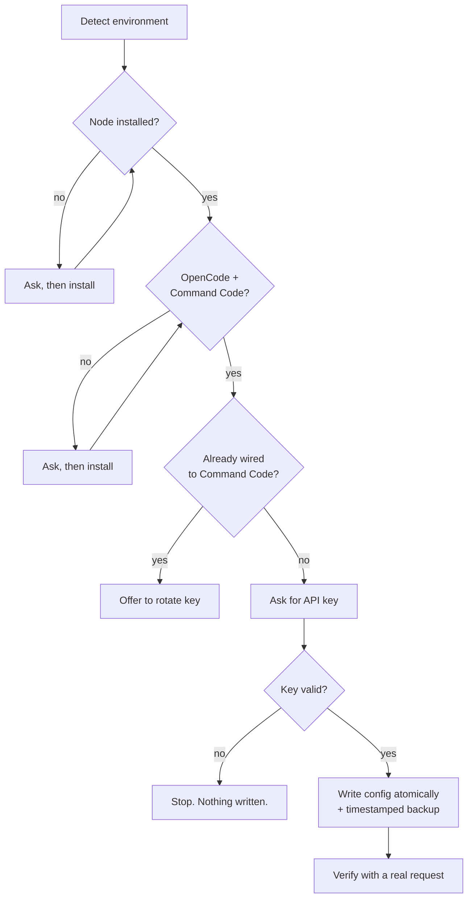

<div align="center">

# opencode-commandcode-tools

**Wire [Command Code](https://commandcode.ai) into [OpenCode](https://opencode.ai) — with one file.**

[](LICENSE)
[](#usage)
[](#requirements)
[](dev/setup-commandcode.test.mjs)

**[English](README.md)** · **[Tiếng Việt](README.vi.md)**

</div>

---

Send **one file** to any machine. It detects what's installed, configures Command
Code as an OpenCode provider, and verifies the result with a real request.

No `git clone`. No dependencies. No API key inside the file.

## Quick start

**1.** Download [`Cai-CommandCode.cmd`](Cai-CommandCode.cmd)

**2.** Run it

| OS | How |
|---|---|
| **Windows** | Double-click |
| **Linux / macOS** | `sh Cai-CommandCode.cmd` |

**3.** Pick a language, paste your API key, done.

> Get a key at [commandcode.ai/settings/keys](https://commandcode.ai/settings/keys).
> Then reopen OpenCode and type `/models` to pick a `cmd/...` model.

## What it looks like

```
  ==================================================
   Chon ngon ngu  /  Choose language
  ==================================================

     [1] English
     [2] Tieng Viet (Vietnamese)

Chon / Choose: 2

==================================================
   COMMAND CODE  →  OPENCODE
==================================================

[1/6] Dò môi trường
      ✓ Node v26.7.0 đã có.
      ✓ OpenCode opencode v2.0.20
      ✓ Command Code 1.69.0 (lệnh: cmdc)

[2/6] Kiểm tra OpenCode đã nối với Command Code chưa
      ! config chưa có providers.cmd.
      Trạng thái: chưa cấu hình

[3/6] Xác định việc cần làm
      Cần cấu hình provider cho OpenCode.
...
[6/6] Cấu hình
      ✓ CLI: đã ghi key.
      ✓ Backup: opencode.json.bak-2026-09-30T02-14-08
      ✓ providers.cmd đã tạo → 74 model.
      ✓ providers.cmd-claude → 10 model.

Kiểm chứng
      ✓ Key khớp ở cả 2 provider.
      ✓ providers.cmd: 74 model.
      ✓ Giữ nguyên: plugins, mcp, agents.
      Đang thử thật một request qua OpenCode...
      ✓ Thử thật thành công (cmd/deepseek/deepseek-v4-flash)

==================================================
   XONG — ĐÃ NỐI XONG
==================================================
```

## How it works



**Key design choices**

| Choice | Why |
|---|---|
| Asks OpenCode where its config lives | No hardcoded paths — works on any machine |
| Validates the key *before* writing | A typo can never break a working setup |
| Only updates the key if the provider exists | Idempotent — safe to re-run |
| Runs a real request at the end | A config that *looks* valid can still be broken |
| Atomic writes (temp → rename) | No half-written config, ever |

## Security

**The file contains no API key.** It only *writes* a key to local config.

| Where | For |
|---|---|
| `~/.commandcode/auth.json` | the Command Code CLI |
| `~/.config/opencode/opencode.json` → `providers.cmd.settings.apiKey` | OpenCode |

The key is validated against the Command Code server **before** anything is written.
A bad key stops the tool with nothing changed.

## Requirements

- **Node.js ≥ 18** — installed automatically if missing (with your confirmation)
- **OpenCode** and **Command Code CLI** — installed automatically if missing
- **Internet** — used to validate the key and fetch the model list

## Usage

### Just run it again

Safe to re-run. If the provider already exists it offers to rotate the key; the
model list is left alone.

### Windows

Double-click `Cai-CommandCode.cmd`, or:

```powershell
.\Cai-CommandCode.cmd
```

### Linux / macOS

```bash
sh Cai-CommandCode.cmd
```

### Non-interactive

Pipe the language choice and key:

```bash
printf '1\nyour_api_key_here\n' | sh Cai-CommandCode.cmd
```

## Development

`Cai-CommandCode.cmd` is **generated**. Edit the source in `dev/`, never the output.

```bash
cd dev
node --test setup-commandcode.test.mjs    # 29 tests
node build-single-file.mjs                # regenerate ../Cai-CommandCode.cmd
```

Forgetting the build step means your change never reaches the released file —
the build script also checks the invariants below and fails loudly if they break.

<details>
<summary><b>How one file runs on two operating systems</b></summary>

<br>

The file is a **polyglot**. Its first line is:

```
: << 'BATCH_EOF'
```

- **sh** reads this as an empty heredoc → skips the entire batch block
- **cmd** reads this as a label → skips the line, runs the batch block

Each then extracts the JavaScript at the end into a temp file and runs `node`.
The file contains, in order: the batch bootstrap, the sh bootstrap, the marker
`#__PAYLOAD__`, then the JavaScript.

</details>

<details>
<summary><b>Why the line endings are mixed, and why the batch is ASCII-only</b></summary>

<br>

**CRLF for the batch block, LF for the sh part.**

`sh` does not strip `\r`, so CRLF would corrupt every variable value. `cmd.exe`
tracks its position in a batch file by byte, so CRLF is what it expects.
`.gitattributes` marks the file `binary` so git never rewrites it — without that,
a Windows clone would corrupt the sh half.

**The batch block must stay pure ASCII.**

This one bit hard. With multi-byte UTF-8 characters in the batch block, `cmd.exe`
mis-computes its read position and starts executing the *sh* block too, producing
garbage like `'Tieng' is not recognized`. All batch messages are ASCII as a result,
and the language menu is the only place both languages appear.

</details>

<details>
<summary><b>Translations</b></summary>

<br>

Both languages live in the `M` object at the top of `dev/setup-commandcode.mjs`.
`en` and `vi` must always have the same keys — a test enforces this.

</details>

## Known limitations

| | |
|---|---|
| **macOS** | Not tested. It ships bash 3.2 and BSD `sed`/`awk`/`tail`, which differ from GNU. |
| **Fresh-machine Node install** | The "installed successfully, now continue" path has never actually run. WSL1 cannot execute Node ≥18 (`Exec format error`), which blocks testing it. A WSL1 limitation, not a bug in this tool. |

Every other path has been run for real: both OS branches, both languages, the
masked key prompt on a real console, the migration path, and a fresh clone.

## License

[MIT](LICENSE) © 2026 Dung-L3
