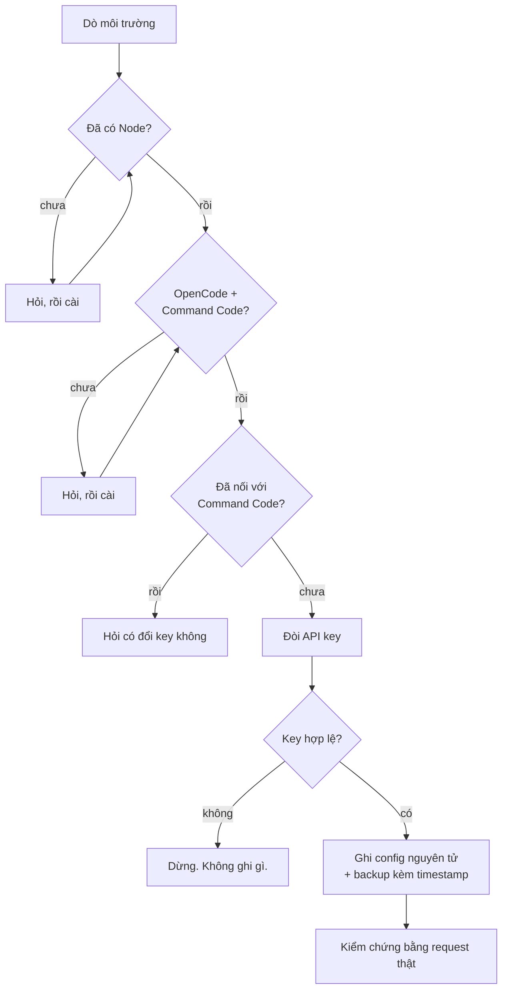

<div align="center">

# opencode-commandcode-tools

**Nối [Command Code](https://commandcode.ai) vào [OpenCode](https://opencode.ai) — bằng một file.**

[](LICENSE)
[](#c%C3%A1ch-d%C3%B9ng)
[](#y%C3%AAu-c%E1%BA%A7u)
[](dev/setup-commandcode.test.mjs)

**[English](README.md)** · **Tiếng Việt**

</div>

---

Gửi **một file** sang bất kỳ máy nào. Nó tự dò những gì đã cài, cấu hình Command Code
thành provider cho OpenCode, rồi kiểm chứng bằng một request thật.

Không cần `git clone`. Không phụ thuộc gì. Không có API key trong file.

## Bắt đầu nhanh

**1.** Tải [`Cai-CommandCode.cmd`](Cai-CommandCode.cmd)

**2.** Chạy

| Hệ điều hành | Cách |
|---|---|
| **Windows** | Nhấp đúp |
| **Linux / macOS** | `sh Cai-CommandCode.cmd` |

**3.** Chọn ngôn ngữ, dán API key, xong.

> Lấy key tại [commandcode.ai/settings/keys](https://commandcode.ai/settings/keys).
> Sau đó mở lại OpenCode và gõ `/models` để chọn model `cmd/...`.

## Chạy trông như thế nào

```
  ==================================================
   Chon ngon ngu  /  Choose language
  ==================================================

     [1] English
     [2] Tieng Viet (Vietnamese)

Chon / Choose: 2

==================================================
   COMMAND CODE  →  OPENCODE
==================================================

[1/6] Dò môi trường
      ✓ Node v26.7.0 đã có.
      ✓ OpenCode opencode v2.0.20
      ✓ Command Code 1.69.0 (lệnh: cmdc)

[2/6] Kiểm tra OpenCode đã nối với Command Code chưa
      ! config chưa có providers.cmd.
      Trạng thái: chưa cấu hình

[3/6] Xác định việc cần làm
      Cần cấu hình provider cho OpenCode.
...
[6/6] Cấu hình
      ✓ CLI: đã ghi key.
      ✓ Backup: opencode.json.bak-2026-09-30T02-14-08
      ✓ providers.cmd đã tạo → 74 model.
      ✓ providers.cmd-claude → 10 model.

Kiểm chứng
      ✓ Key khớp ở cả 2 provider.
      ✓ providers.cmd: 74 model.
      ✓ Giữ nguyên: plugins, mcp, agents.
      Đang thử thật một request qua OpenCode...
      ✓ Thử thật thành công (cmd/deepseek/deepseek-v4-flash)

==================================================
   XONG — ĐÃ NỐI XONG
==================================================
```

## Cách hoạt động



**Vài lựa chọn thiết kế**

| Lựa chọn | Vì sao |
|---|---|
| Hỏi chính OpenCode xem config ở đâu | Không hardcode đường dẫn — chạy được trên mọi máy |
| Kiểm tra key *trước khi* ghi | Gõ nhầm không bao giờ phá được setup đang chạy |
| Chỉ đổi key nếu provider đã tồn tại | Idempotent — chạy lại thoải mái |
| Chạy request thật ở bước cuối | Config *trông* hợp lệ vẫn có thể hỏng thật |
| Ghi nguyên tử (file tạm → rename) | Không bao giờ để lại config dở dang |

## An toàn

**Trong file không có API key.** Nó chỉ *ghi* key vào config cục bộ.

| Nơi lưu | Cho |
|---|---|
| `~/.commandcode/auth.json` | Command Code CLI |
| `~/.config/opencode/opencode.json` → `providers.cmd.settings.apiKey` | OpenCode |

Key được kiểm tra với máy chủ Command Code **trước khi** ghi bất cứ thứ gì. Key sai
thì dừng lại, không thay đổi gì cả.

## Yêu cầu

- **Node.js ≥ 18** — tự cài nếu thiếu (có hỏi trước)
- **OpenCode** và **Command Code CLI** — tự cài nếu thiếu
- **Mạng** — để kiểm tra key và lấy danh sách model

## Cách dùng

### Cứ chạy lại

Chạy lại an toàn. Nếu provider đã tồn tại thì nó hỏi có muốn đổi key không; danh sách
model giữ nguyên.

### Windows

Nhấp đúp `Cai-CommandCode.cmd`, hoặc:

```powershell
.\Cai-CommandCode.cmd
```

### Linux / macOS

```bash
sh Cai-CommandCode.cmd
```

### Không tương tác

Pipe sẵn lựa chọn ngôn ngữ và key:

```bash
printf '2\nkey_cua_ban\n' | sh Cai-CommandCode.cmd
```

## Phát triển

`Cai-CommandCode.cmd` là **file sinh ra**. Sửa nguồn trong `dev/`, đừng sửa file output.

```bash
cd dev
node --test setup-commandcode.test.mjs    # 29 test
node build-single-file.mjs                # sinh lại ../Cai-CommandCode.cmd
```

Quên bước build nghĩa là thay đổi của bạn không bao giờ tới file phát hành — build
script còn kiểm tra các ràng buộc bên dưới và báo lỗi ngay nếu chúng vỡ.

<details>
<summary><b>Vì sao một file chạy được trên hai hệ điều hành</b></summary>

<br>

File này là **polyglot**. Dòng đầu tiên:

```
: << 'BATCH_EOF'
```

- **sh** hiểu là heredoc rỗng → bỏ qua toàn bộ khối batch
- **cmd** hiểu là label → bỏ qua dòng đó, chạy thẳng khối batch

Cả hai sau đó tách phần JavaScript ở cuối ra file tạm rồi gọi `node`. Cấu trúc file,
theo thứ tự: bootstrap batch, bootstrap sh, marker `#__PAYLOAD__`, rồi JavaScript.

</details>

<details>
<summary><b>Vì sao line ending bị trộn, và vì sao khối batch phải thuần ASCII</b></summary>

<br>

**CRLF cho khối batch, LF cho phần sh.**

`sh` không tự cắt `\r`, nên CRLF sẽ làm hỏng mọi giá trị biến. Còn `cmd.exe` theo dõi
vị trí trong file batch theo byte, nên CRLF mới là dạng nó chờ đợi. `.gitattributes`
đánh dấu file là `binary` để git không bao giờ ghi đè — thiếu bước đó, một bản clone
trên Windows sẽ phá nửa phần sh.

**Khối batch phải thuần ASCII.**

Chỗ này từng làm tôi vấp nặng. Khi có ký tự UTF-8 nhiều byte trong khối batch,
`cmd.exe` tính sai vị trí đọc và bắt đầu **chạy luôn cả khối sh**, sinh ra rác kiểu
`'Tiếng' is not recognized`. Nên mọi thông báo trong batch đều là ASCII, và menu chọn
ngôn ngữ là chỗ duy nhất có cả hai thứ tiếng.

</details>

<details>
<summary><b>Bản dịch</b></summary>

<br>

Cả hai thứ tiếng nằm trong object `M` ở đầu `dev/setup-commandcode.mjs`. `en` và `vi`
phải luôn có đủ cùng số khoá — có một test canh việc này.

</details>

## Giấy phép

[MIT](LICENSE) © 2026 Dung-L3
